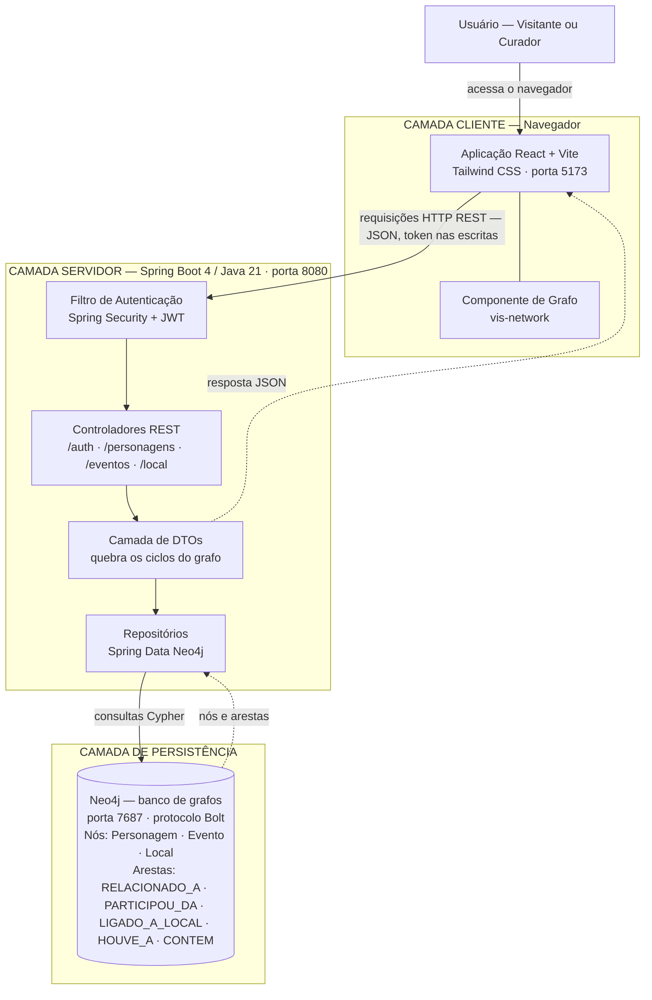
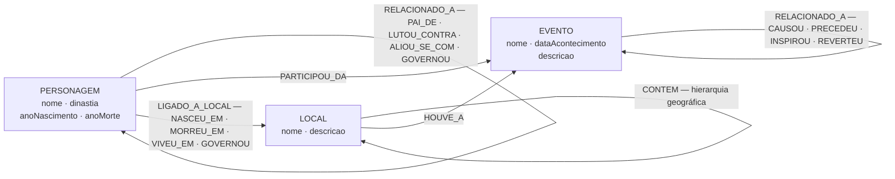

# ETAPA 01 — Proposta e Especificação do Projeto

**Aplicação:** História em Grafos
**Aluno:** Enzo Simon
**Disciplina:** Tecnologia de Construção de Software 1
**Professor:** Jaderson
**Data:** 26/08/2026

---

## 1. Nome da aplicação

**História em Grafos**

Aplicação Web para registro, organização e exploração visual de conhecimento histórico representado como uma rede de conexões.

---

## 2. Descrição do problema que pretende resolver

O conhecimento histórico é quase sempre registrado e ensinado de forma **linear**: linhas do tempo, capítulos de livro, textos corridos e planilhas. Esse formato funciona bem para narrar *uma* sequência de fatos, mas esconde aquilo que dá sentido à História — a **teia de relações** entre pessoas, acontecimentos e lugares.

Na prática, quem estuda ou pesquisa História precisa responder perguntas que são naturalmente **relacionais**, e não sequenciais:

- Quem são os descendentes diretos de determinado governante, e em quantas gerações?
- Quais eventos foram causados, direta ou indiretamente, por uma única batalha?
- Que personagens de dinastias rivais participaram do mesmo evento?
- Quais acontecimentos ocorreram dentro de um território, considerando também as regiões que ele contém?

Hoje, responder a essas perguntas exige que o pesquisador leia várias fontes, anote os nomes em papel ou planilha e faça o cruzamento **mentalmente**. O esforço cresce rapidamente conforme o acervo aumenta: com 30 personagens, 20 eventos e 15 locais, o número de ligações possíveis já ultrapassa a capacidade de acompanhar de cabeça. O conhecimento existe, mas fica **fragmentado e não consultável**.

O problema que a aplicação ataca é, portanto, de **organização e consulta de conhecimento altamente conectado**: dar ao usuário uma forma de *cadastrar as relações* — e não apenas os fatos isolados — e de *navegar* por elas visualmente, substituindo o cruzamento manual por exploração interativa.

> **Por que isso não é um CRUD trivial:** o valor da aplicação não está em guardar fichas de personagens, e sim nas **arestas** entre elas. A relação é uma entidade de primeira classe — tem tipo, direção e descrição própria — e é sobre ela que recaem as consultas mais úteis do sistema. O cadastro é meio; a travessia da rede é o fim.

---

## 3. Público-alvo

| Perfil | Necessidade que a aplicação atende |
|---|---|
| **Professores de História (ensino médio e superior)** | Preparar material de aula que mostre visualmente causas, consequências e vínculos entre acontecimentos, em vez de apenas listar datas. |
| **Estudantes** | Estudar um período histórico entendendo como os fatos se conectam; revisar conteúdo navegando pelo grafo em vez de reler textos. |
| **Pesquisadores e historiadores amadores** | Consolidar num único acervo estruturado as anotações de pesquisa que hoje ficam espalhadas em cadernos, documentos e planilhas. |
| **Criadores de conteúdo e autores de ficção (*worldbuilding*)** | Manter a coerência de universos ficcionais extensos, com genealogias, linhas de sucessão e cronologias de eventos. |
| **Curadores de acervos culturais (museus, arquivos)** | Documentar a relação entre personagens históricos, acontecimentos e localidades do acervo sob sua responsabilidade. |

O sistema separa dois papéis de uso:

- **Visitante** — consulta o acervo livremente, sem autenticação. É a maior parte do público (alunos, curiosos, leitores).
- **Curador** — usuário autenticado, responsável por alimentar e manter o acervo. É quem cadastra entidades e cria as relações.

---

## 4. Objetivo principal da aplicação

Permitir que um curador **cadastre entidades históricas e, principalmente, as relações tipadas entre elas**, e que qualquer usuário **explore esse acervo como um grafo interativo**, transformando consultas relacionais complexas em navegação visual.

Objetivos específicos que decorrem do principal:

1. Tornar explícita e consultável a estrutura de conexões que hoje só existe implícita nos textos.
2. Reduzir o esforço de responder perguntas de múltiplos saltos ("quem se relaciona com quem se relaciona com quem").
3. Servir como ferramenta de apoio didático, com leitura pública e escrita controlada.
4. Manter o acervo consistente ao longo do tempo, permitindo edição e remoção controlada de entidades e vínculos.

---

## 5. Funcionalidades que a aplicação deverá possuir

> O documento pede no mínimo 5. São descritas 8.

| # | Funcionalidade | Descrição |
|---|---|---|
| **F1** | **Autenticação de curador** | Login com usuário e senha que devolve um token de sessão. O token acompanha toda requisição de escrita e define o que o usuário pode fazer. |
| **F2** | **Gestão de entidades históricas** | Cadastro, consulta, edição e remoção de Personagens, Eventos e Locais, cada um com seus próprios atributos. |
| **F3** | **Criação de relações tipadas** | Ligação de duas entidades por meio de uma relação que possui **tipo** (ex.: `PAI_DE`, `CAUSOU`, `NASCEU_EM`) e **descrição livre**, permitindo registrar a natureza exata do vínculo. |
| **F4** | **Visualização em grafo interativo** | Renderização de todo o acervo como um grafo navegável: nós com forma e cor distintas por tipo de entidade, arestas rotuladas pelo tipo de relação, com zoom, arraste e reorganização automática do layout. |
| **F5** | **Painel de visão geral (dashboard)** | Tela com as contagens do acervo (total de personagens, eventos, locais e relações) e as listagens navegáveis de cada tipo de entidade. |
| **F6** | **Busca por nome** | Localização de uma entidade pelo nome, com resultado parcial, para chegar rapidamente a um ponto de partida no acervo. |
| **F7** | **Painel de detalhe da entidade** | Ao selecionar um nó do grafo ou um item de uma lista, exibição de todos os seus atributos **e de todas as suas conexões**, agrupadas por tipo, permitindo saltar para as entidades vizinhas. |
| **F8** | **Controle de acesso por papel** | Leitura pública e irrestrita; qualquer operação de escrita (criar, editar, remover, vincular, desvincular) exigindo autenticação de curador. |

---

## 6. Entidades e conceitos importantes do domínio

> O documento pede no mínimo 3. São descritas 4.

### 6.1 Personagem

Pessoa histórica registrada no acervo.

| Atributo | Tipo | Descrição |
|---|---|---|
| `id` | Identificador | Chave única gerada pelo sistema. |
| `nome` | Texto | Nome pelo qual o personagem é conhecido. |
| `dinastia` | Texto | Casa, família, facção ou grupo de origem. Usada também para colorir o nó no grafo. |
| `anoNascimento` | Número inteiro | Ano de nascimento (aceita valores negativos para a.C.). |
| `anoMorte` | Número inteiro | Ano de falecimento. |

### 6.2 Evento

Acontecimento histórico relevante.

| Atributo | Tipo | Descrição |
|---|---|---|
| `id` | Identificador | Chave única gerada pelo sistema. |
| `nome` | Texto | Nome do acontecimento. |
| `dataAcontecimento` | Texto | Data ou período em que ocorreu, em formato livre para acomodar datas imprecisas ("séc. XII", "c. 1204"). |
| `descricao` | Texto | Resumo do que aconteceu e de sua relevância. |

### 6.3 Local

Lugar geográfico ou político onde fatos ocorreram.

| Atributo | Tipo | Descrição |
|---|---|---|
| `id` | Identificador | Chave única gerada pelo sistema. |
| `nome` | Texto | Nome do local. |
| `descricao` | Texto | Caracterização do lugar e de sua importância. |

Locais são **hierárquicos**: um local pode conter outros (império → província → cidade), o que permite consultas por área de abrangência.

### 6.4 Relação — o conceito central

A **Relação** é o conceito que dá razão de ser à aplicação e, por isso, é tratada como entidade de primeira classe: não é um simples campo de ligação, mas um objeto com **direção**, **tipo** e **descrição** própria.

| Atributo | Tipo | Descrição |
|---|---|---|
| `tipo` | Texto (catálogo) | Natureza do vínculo, escolhida a partir de um catálogo controlado. |
| `descricao` | Texto | Detalhamento livre do vínculo específico ("aliança selada após o cerco de 1187"). |
| `origem` | Entidade | Ponta de onde a relação parte. |
| `destino` | Entidade | Ponta para onde a relação aponta. |

**Catálogo de tipos de relação previsto:**

| Ligação | Entre | Tipos possíveis |
|---|---|---|
| `RELACIONADO_A` | Personagem → Personagem | `PAI_DE`, `LUTOU_CONTRA`, `ALIOU_SE_COM`, `GOVERNOU` |
| `RELACIONADO_A` | Evento → Evento | `CAUSOU`, `PRECEDEU`, `INSPIROU`, `REVERTEU` |
| `LIGADO_A_LOCAL` | Personagem → Local | `NASCEU_EM`, `MORREU_EM`, `VIVEU_EM`, `GOVERNOU` |
| `PARTICIPOU_DA` | Personagem → Evento | — (a participação é o próprio tipo) |
| `HOUVE_A` | Local → Evento | — (o local sediou o evento) |
| `CONTEM` | Local → Local | — (hierarquia geográfica) |

O catálogo é **extensível**: novos tipos podem ser acrescentados ao longo do semestre sem alterar a estrutura do banco, porque o tipo é um dado da relação e não uma nova tabela.

---

## 7. Telas e interfaces

> O documento pede no mínimo 3. São descritas 5.

### 7.1 Tela de Login do Curador

- **Propósito:** autenticar quem vai alimentar o acervo.
- **Acesso:** pública (a tela), mas só concede sessão a credenciais válidas.
- **Elementos:** campo de usuário, campo de senha, botão *Entrar*, mensagem de erro em caso de credencial inválida.
- **Comportamento:** apresentada como janela sobreposta (modal) sobre a interface principal, de modo que o visitante nunca é obrigado a passar por ela para consultar o acervo. Autenticado o curador, a interface passa a exibir os controles de edição.

### 7.2 Tela de Visão Geral (Dashboard)

- **Propósito:** dar a leitura tabular do acervo e servir de ponto de entrada para as demais telas.
- **Acesso:** pública para leitura; botões de ação visíveis apenas ao curador.
- **Elementos:**
  - Cartões com as contagens totais de Personagens, Eventos, Locais e Relações.
  - Abas internas: *Visão Geral*, *Personagens*, *Eventos*, *Locais*.
  - Listagem de cada tipo de entidade, com campo de busca por nome.
  - Botões *Novo*, *Editar* e *Remover* por item, visíveis somente ao curador.

### 7.3 Tela do Grafo de Conexões

- **Propósito:** tela principal e diferencial do sistema — mostrar o acervo inteiro como rede navegável.
- **Acesso:** pública.
- **Elementos:**
  - Área de desenho ocupando a maior parte do espaço, com o grafo renderizado.
  - Nós diferenciados por tipo: Personagem (retângulo, cor conforme a dinastia), Evento (círculo, laranja), Local (elipse, verde).
  - Arestas direcionadas e rotuladas com o tipo da relação.
  - Legenda dos tipos de nó e cor de dinastia.
  - Controles de zoom e arraste; layout com organização automática.
- **Interações:** clicar em um nó abre o painel de detalhe daquela entidade; clicar em uma aresta exibe o tipo e a descrição do vínculo; arrastar um nó reposiciona-o.

### 7.4 Painel de Detalhe da Entidade

- **Propósito:** concentrar tudo o que se sabe sobre uma entidade e permitir saltar para suas vizinhas.
- **Acesso:** público para leitura; ações de edição restritas ao curador.
- **Elementos:**
  - Cabeçalho com nome e tipo da entidade.
  - Bloco de atributos (dinastia e anos, para Personagem; data e descrição, para Evento; descrição, para Local).
  - Lista de conexões **agrupada por tipo de relação**, cada item clicável para navegar até a entidade vizinha.
  - Botões *Editar*, *Remover* e *Criar relação*, visíveis somente ao curador.

### 7.5 Formulários de Cadastro, Edição e Vínculo

- **Propósito:** entrada e manutenção de dados.
- **Acesso:** exclusivo do curador.
- **Elementos:**
  - *Formulário de entidade:* campos correspondentes ao tipo escolhido, com validação dos obrigatórios; botões *Salvar* e *Cancelar*.
  - *Formulário de relação:* seleção da entidade de origem, seleção da entidade de destino (com busca por nome), escolha do **tipo de relação** a partir do catálogo e campo de descrição livre.
  - *Confirmação de remoção:* diálogo que exige confirmação explícita, alertando que as relações ligadas à entidade também serão desfeitas.
- **Comportamento:** apresentados como janelas modais sobre a tela corrente, para não perder o contexto de navegação.

---

## 8. Operações que deverão existir na aplicação

> O documento pede no mínimo 5. São descritas 10.

| # | Operação | Descrição | Entrada | Saída | Permissão |
|---|---|---|---|---|---|
| **O1** | **Autenticar curador** | Valida as credenciais e emite o token de sessão usado nas operações de escrita. | Usuário e senha | Token de acesso e prazo de validade | Pública |
| **O2** | **Listar entidades** | Devolve todas as entidades de um tipo, com seus atributos e um resumo de suas relações. | Tipo da entidade | Coleção de entidades | Pública |
| **O3** | **Buscar entidade por nome** | Localiza entidades cujo nome contenha o termo informado. | Tipo e termo de busca | Coleção de entidades correspondentes | Pública |
| **O4** | **Consultar detalhe de uma entidade** | Devolve uma entidade com todos os seus atributos e **todas as suas conexões**, agrupadas por tipo. | Tipo e identificador | Entidade detalhada com vizinhança | Pública |
| **O5** | **Cadastrar entidade** | Registra um novo Personagem, Evento ou Local no acervo. | Tipo e atributos | Entidade criada, com identificador | Curador |
| **O6** | **Editar entidade** | Atualiza os atributos de uma entidade existente, preservando suas relações. | Tipo, identificador e atributos | Entidade atualizada | Curador |
| **O7** | **Remover entidade** | Exclui uma entidade e desfaz as relações que dependiam dela. | Tipo e identificador | Confirmação da remoção | Curador |
| **O8** | **Vincular duas entidades** | Cria uma relação tipada e direcionada entre duas entidades, com descrição própria. | Identificador de origem, identificador de destino, tipo e descrição | Relação criada | Curador |
| **O9** | **Desvincular duas entidades** | Remove uma relação específica sem apagar as entidades envolvidas. | Identificador de origem e identificador de destino | Confirmação da remoção | Curador |
| **O10** | **Montar o grafo completo** | Reúne todas as entidades e todas as relações num único conjunto pronto para renderização visual. | — | Conjunto de nós e arestas | Pública |

**Regra transversal de autorização:** todas as operações de leitura (O2, O3, O4, O10) são públicas; todas as operações de escrita (O5 a O9) exigem token válido de curador. Requisição de escrita sem token, ou com token expirado, é rejeitada.

---

## 9. Tecnologias que pretende utilizar no cliente

| Tecnologia | Papel na solução |
|---|---|
| **React 19** | Biblioteca de construção da interface, organizada em componentes com estado. |
| **Vite** | Ferramenta de build e servidor de desenvolvimento, com recarga instantânea. |
| **JavaScript (ES Modules)** | Linguagem da camada cliente. |
| **Tailwind CSS v4** | Estilização por classes utilitárias; tema escuro, adequado à leitura do grafo. |
| **vis-network + vis-data** | Renderização e simulação física do grafo interativo (nós, arestas, zoom, arraste, layout automático). |
| **Fetch API** | Consumo da API REST do servidor. |
| **`localStorage`** | Armazenamento do token de sessão do curador entre recarregamentos da página. |

---

## 10. Tecnologias que pretende utilizar no servidor

| Tecnologia | Papel na solução |
|---|---|
| **Java 21** | Linguagem da camada servidora. |
| **Spring Boot 4** | Framework de aplicação; configuração e ciclo de vida do servidor. |
| **Spring Web MVC** | Exposição da API REST (controladores e rotas). |
| **Spring Security** | Cadeia de filtros de segurança e autorização por papel. |
| **Spring Data Neo4j** | Mapeamento entre as classes de domínio e os nós/arestas do banco de grafos. |
| **JJWT** | Geração e validação dos tokens de autenticação. |
| **Maven** | Gerenciamento de dependências e build do projeto. |

**Arquitetura do servidor:** API REST em camadas — *Controladores* (rotas e validação de entrada) → *Repositórios* (acesso ao banco) → *Entidades de domínio*, com uma camada de **objetos de transferência de dados (DTO)** entre o domínio e a resposta HTTP. Essa camada é necessária porque um grafo tem ciclos (A se relaciona com B, que se relaciona com A) e serializar as entidades diretamente causaria recursão infinita.

---

## 11. Tecnologia de persistência

**Neo4j** — banco de dados **de grafos nativo**, acessado pelo protocolo Bolt.

**Modelo de armazenamento:**

- **Nós:** `Personagem`, `Evento`, `Local`.
- **Arestas:** `RELACIONADO_A`, `PARTICIPOU_DA`, `LIGADO_A_LOCAL`, `HOUVE_A`, `CONTEM` — cada uma podendo carregar as propriedades `tipo` e `descricao`.

**Justificativa da escolha:**

O domínio da aplicação **é** uma rede, não um conjunto de tabelas. Essa escolha é o que sustenta a proposta:

1. **A relação carrega dados.** Num banco relacional, registrar que uma ligação tem tipo e descrição exigiria tabelas de associação para cada par de entidades. Em grafo, a aresta é um objeto que guarda suas próprias propriedades.
2. **Consultas de múltiplos saltos são o caso de uso principal.** Perguntas como "todos os descendentes em até 4 gerações" ou "a cadeia de eventos causada por este" exigem, em SQL, junções recursivas cujo custo cresce a cada nível. Em Neo4j a travessia percorre ponteiros diretos entre nós, e o custo depende do tamanho do resultado, não do tamanho da tabela.
3. **O modelo de dados espelha a tela.** O que o banco armazena (nós e arestas) é exatamente o que a interface desenha, o que reduz a distância entre persistência e apresentação.
4. **Flexibilidade de esquema.** Novos tipos de relação entram como um valor de propriedade, sem migração de esquema — importante num projeto que evoluirá ao longo do semestre.

Dados de configuração sensíveis (endereço do banco, usuário, senha e chave de assinatura dos tokens) ficam fora do controle de versão, em arquivo de configuração local.

---

## 12. Diagrama da visão geral da solução

### 12.1 Arquitetura da solução

**Leitura do diagrama:** o usuário interage apenas com a camada cliente, que não conhece o banco de dados. Toda requisição atravessa primeiro o **filtro de autenticação**: leituras passam livremente, escritas só prosseguem com token de curador válido. Os controladores acionam os repositórios, que traduzem as operações para o Neo4j. O retorno passa pela **camada de DTOs**, responsável por transformar o grafo — que tem ciclos — numa estrutura JSON finita, antes de voltar ao cliente.

### 12.2 Modelo de domínio

**Leitura do diagrama:** os três tipos de entidade se conectam entre si e também a si mesmos (um personagem se relaciona com outro personagem; um local contém outro local). São essas **arestas recursivas** que possibilitam as consultas de múltiplos saltos descritas no item 11 — genealogias, cadeias de causa e consequência e hierarquias territoriais.

---

## Evolução prevista ao longo do semestre

A especificação acima define o escopo mínimo funcional. As etapas seguintes da disciplina devem incorporar, de forma incremental:

| Frente | Evolução prevista |
|---|---|
| **Modelo de dados** | Novos tipos de relação no catálogo; atributos de fonte/referência bibliográfica nas entidades. |
| **Consulta** | Filtro do grafo por tipo de entidade, período e dinastia; consulta de caminho mínimo entre duas entidades. |
| **Visualização** | Linha do tempo dos eventos, sincronizada com o grafo; exportação do grafo como imagem. |
| **Usabilidade** | Atualização do painel em tempo real após operações de escrita; aviso de sessão expirada. |
| **Segurança** | Múltiplos curadores com contas individuais e registro de autoria das alterações. |
| **Qualidade** | Testes automatizados das operações e validação de dados de entrada. |

As tecnologias declaradas nos itens 9, 10 e 11 podem ser ajustadas nas próximas etapas, desde que preservada a coerência da solução: cliente Web em componentes, servidor com API REST e persistência orientada a grafos.
